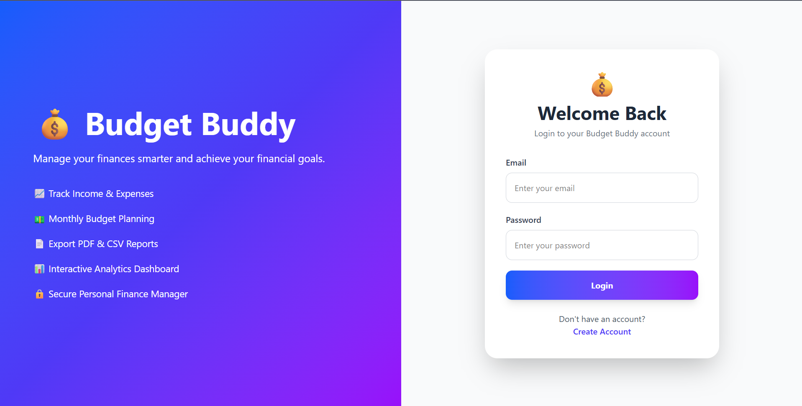
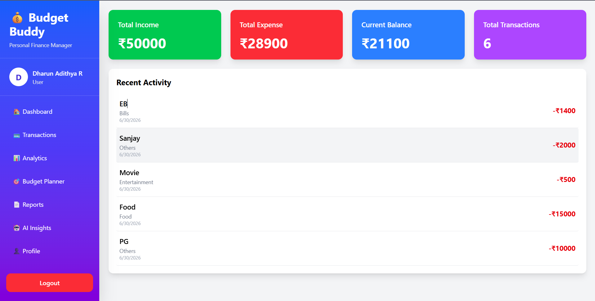
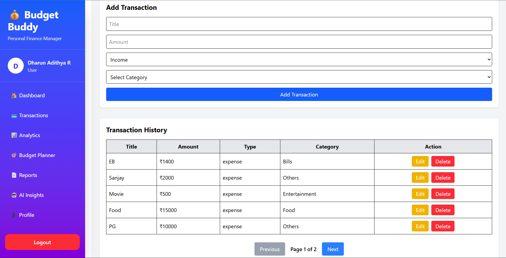
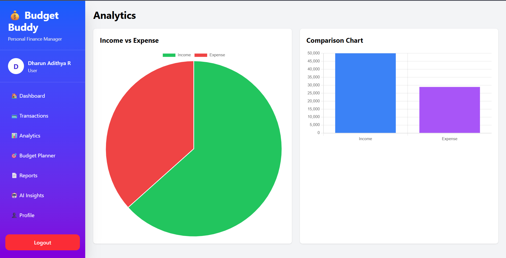
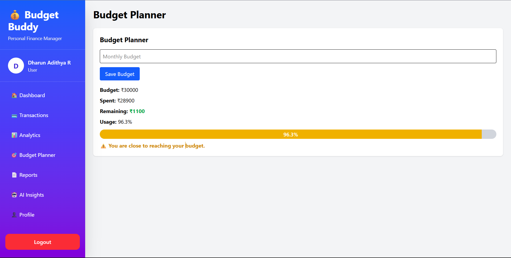
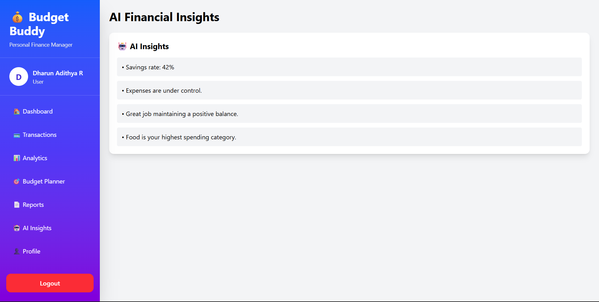
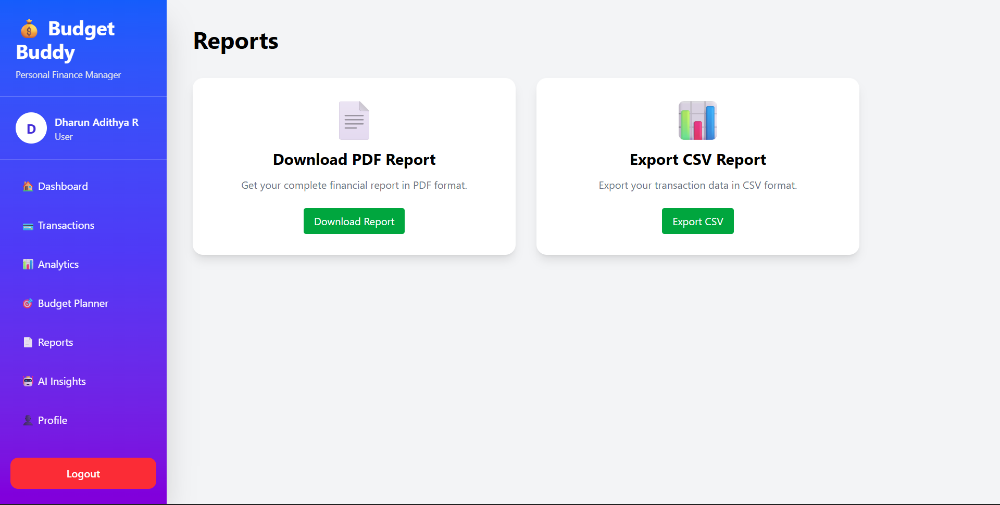
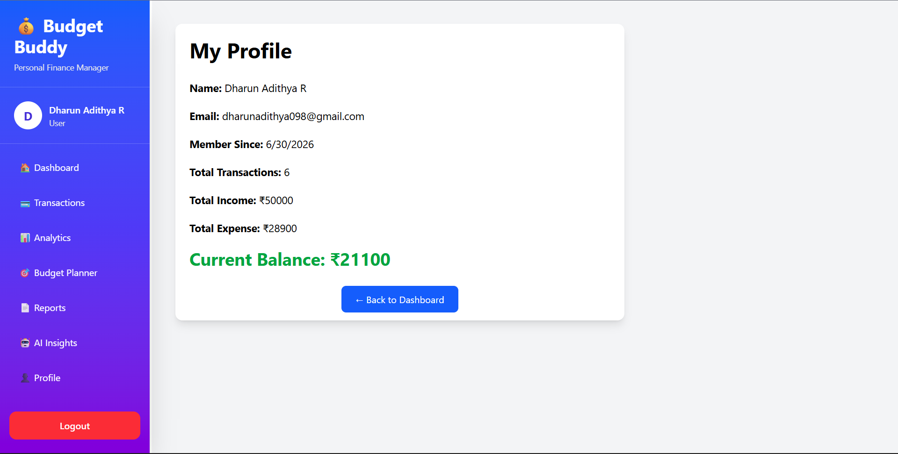

<div align="center">

# 💰 Budget Buddy
### AI-Powered Personal Finance Management System

Manage your income, expenses, budgets, analytics, and financial reports with an intuitive MERN Stack application.

<p align="center">


</p>

</div>

---

# 📖 Overview

**Budget Buddy** is a full-stack MERN application that helps users take complete control of their personal finances.

It allows users to:

- 💵 Track income and expenses
- 📊 Visualize financial data using interactive charts
- 🎯 Set monthly budgets
- 🤖 Receive AI-generated financial insights
- 📄 Export reports in PDF & CSV formats
- 🔒 Securely manage their financial data using JWT Authentication

The application is built with scalability, clean UI, and responsive design in mind.

---

# 🚀 Live Demo

### 🌐 Frontend

https://finance-tracker-icqx-six.vercel.app/

### ⚡ Backend API

https://finance-tracker-backend-8olx.onrender.com/

---

# ✨ Features

## 🔐 Authentication

- User Registration
- Secure Login
- JWT Authentication
- Protected Routes
- Password Encryption using bcrypt

---

## 💳 Transaction Management

- Add Transactions
- Edit Transactions
- Delete Transactions
- Income & Expense Tracking
- Category-based Transactions
- Pagination Support

---

## 📊 Dashboard

- Financial Summary Cards
- Current Balance
- Recent Activity
- Total Income
- Total Expenses
- Transaction Count

---

## 📈 Analytics

- Income vs Expense Pie Chart
- Comparison Bar Chart
- Spending Visualization
- Financial Insights

---

## 🎯 Budget Planner

- Set Monthly Budget
- Remaining Budget Calculation
- Budget Usage Percentage
- Smart Budget Alerts

---

## 🤖 AI Financial Insights

Automatically generates insights such as:

- Savings Rate
- Highest Spending Category
- Expense Status
- Budget Recommendations

---

## 📄 Reports

- Download PDF Financial Report
- Export Transactions as CSV

---

## 👤 Profile

- User Information
- Account Summary
- Total Income
- Total Expense
- Current Balance

---

# 🛠 Tech Stack

## Frontend

- React.js
- Vite
- React Router DOM
- Axios
- Chart.js
- React ChartJS 2
- jsPDF
- jsPDF AutoTable
- CSS3

---

## Backend

- Node.js
- Express.js
- MongoDB Atlas
- Mongoose
- JWT Authentication
- bcrypt.js
- CORS
- dotenv

---

## Database

- MongoDB Atlas

---

## Deployment

| Service | Platform |
|----------|----------|
| Frontend | Vercel |
| Backend | Render |
| Database | MongoDB Atlas |

---

# 📂 Project Structure

```text
Budget-Buddy
│
├── client
│   ├── public
│   ├── src
│   │   ├── assets
│   │   ├── components
│   │   ├── pages
│   │   ├── App.jsx
│   │   └── main.jsx
│   ├── package.json
│   └── vite.config.js
│
├── server
│   ├── config
│   ├── controllers
│   ├── middleware
│   ├── models
│   ├── routes
│   ├── utils
│   ├── server.js
│   └── package.json
│
├── package.json
└── README.md
```

---

# ⚙️ Installation

## 1️⃣ Clone Repository

```bash
git clone https://github.com/DharunAdithyaR/Finance-Tracker.git

cd Finance-Tracker
```

---

## 2️⃣ Backend Setup

```bash
cd server

npm install
```

Create a **.env**

```env
PORT=5000

MONGO_URI=your_mongodb_connection_string

JWT_SECRET=your_secret_key
```

Run Backend

```bash
npm run dev
```

---

## 3️⃣ Frontend Setup

```bash
cd client

npm install

npm run dev
```

---

# 📸 Application Screenshots

## 🔑 Login



---

## 🏠 Dashboard



---

## 💳 Transactions



---

## 📊 Analytics



---

## 🎯 Budget Planner



---

## 🤖 AI Insights



---

## 📄 Reports



---

## 👤 Profile



---

# 🔒 Security

- JWT Authentication
- Password Hashing using bcrypt
- Protected API Routes
- User-specific Data Isolation
- Secure MongoDB Atlas Connection

---

# 📈 REST API Modules

```
Authentication
│
├── Register
└── Login

Transactions
│
├── Add
├── Edit
├── Delete
└── Get All

Budget
│
├── Set Budget
└── Get Budget

Analytics
│
├── Income vs Expense
└── Category Analysis

Reports
│
├── PDF Export
└── CSV Export

Profile
│
└── User Summary
```

---

# 🎯 Key Highlights

✅ MERN Stack Project

✅ JWT Authentication

✅ Responsive Dashboard

✅ Interactive Charts

✅ Monthly Budget Planner

✅ AI Financial Insights

✅ PDF Report Generation

✅ CSV Export

✅ RESTful APIs

✅ MongoDB Atlas Integration

---

# 🎓 Learning Outcomes

This project strengthened my understanding of:

- Full-Stack MERN Development
- REST API Design
- Authentication & Authorization
- MongoDB Data Modeling
- React State Management
- Chart.js Data Visualization
- File Generation (PDF & CSV)
- Deployment using Vercel & Render
- Clean UI/UX Design
- Git & GitHub Workflow

---

# 👨‍💻 Author

## Dharun Adithya R

GitHub

**https://github.com/DharunAdithyaR**

---

# ⭐ Support

If you found this project helpful, consider giving it a **⭐ Star** on GitHub.

It motivates me to build more open-source projects!

---

# 📜 License

This project is licensed under the **MIT License**.

Feel free to use it for learning, personal projects, and portfolio purposes.